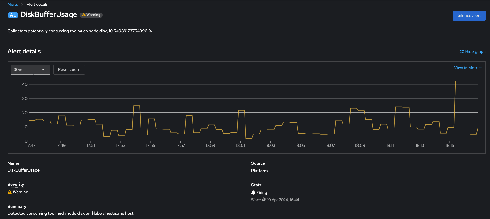
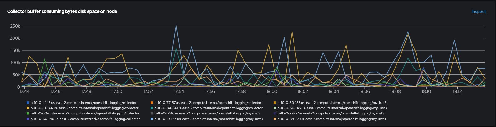
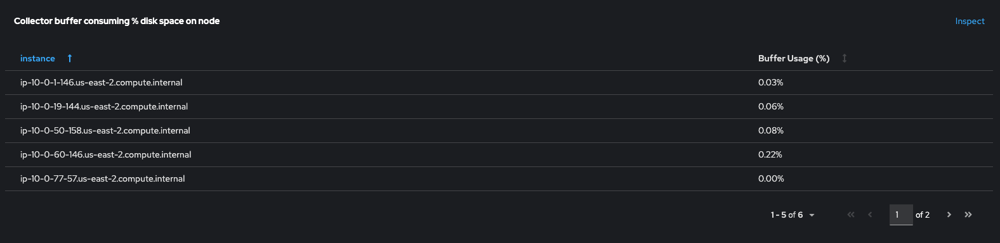

= Collector Metrics and Alerts

== Vector output buffer alert
In logging 6.0 (5.9.x) and later versions, added alerts for the Vector collector potentially consuming excessive node disk space.
You can view this alerts in the OpenShift Container Platform web console.

=== Vector output buffer metrics
Along with new alert was added 2 metrics dashboards which allow monitoring state of output buffer.

- panel showing the absolute size of the Vector buffer via a graph by instance, namespace and instance name:

[source]
----
sum by(hostname, component_kind, namespace, app_kubernetes_io_instance)(vector_buffer_byte_size{component_kind='sink', buffer_type='disk'})
----

- panel showing the percentage of buffer size relative to the total disk space on the node:

[source]
----
100 * (label_replace(sum by(hostname) (vector_buffer_byte_size{component_kind='sink', buffer_type='disk'}), 'instance', '$1', 'hostname', '(.*)') / on(instance) group_left() sum by(instance) (node_filesystem_size_bytes{mountpoint='/var'}))
----
== Enabling ability to collect metrics from non infrastructure namespaces

To make it possible for collecting Collector metrics in namespace different from "openshift-logging"
need to:

- add label _openshift.io/cluster-monitoring: "true"_ to your namespace
[source]
----
oc label namespace {your-logging-ns} "openshift.io/cluster-monitoring='true'"
----
 - add role _prometheus-k8s_ to your namespace
[source]
----
cat <<EOF | oc create -f -
apiVersion: rbac.authorization.k8s.io/v1
kind: Role
metadata:
  name: prometheus-k8s
  namespace: {your-logging-ns}
  annotations:
    capability.openshift.io/name: logging-collector
rules:
  - apiGroups:
      - ""
    resources:
      - services
      - endpoints
      - pods
    verbs:
      - get
      - list
      - watch
EOF
----

  - add role binding:

[source]
----
cat <<EOF |oc create -f -
apiVersion: rbac.authorization.k8s.io/v1
kind: RoleBinding
metadata:
  name: prometheus-k8s
  namespace: {your-logging-ns}
roleRef:
  apiGroup: rbac.authorization.k8s.io
  kind: Role
  name: prometheus-k8s
subjects:
  - kind: ServiceAccount
    name: prometheus-k8s
    namespace: openshift-monitoring
EOF
----

