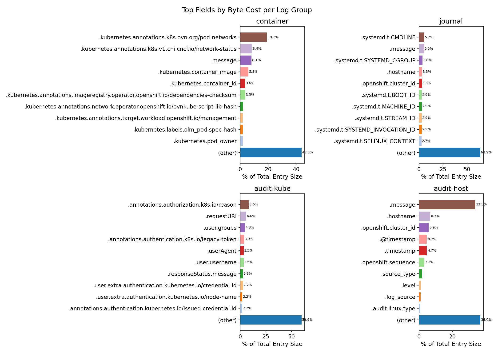
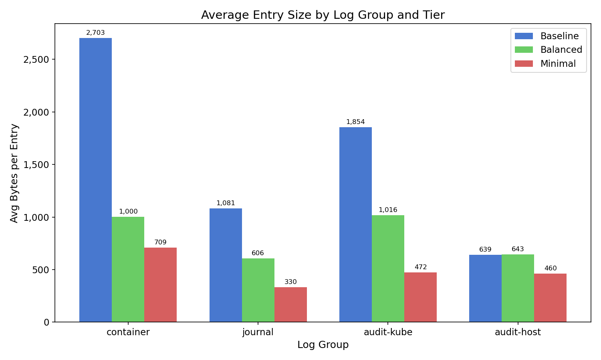
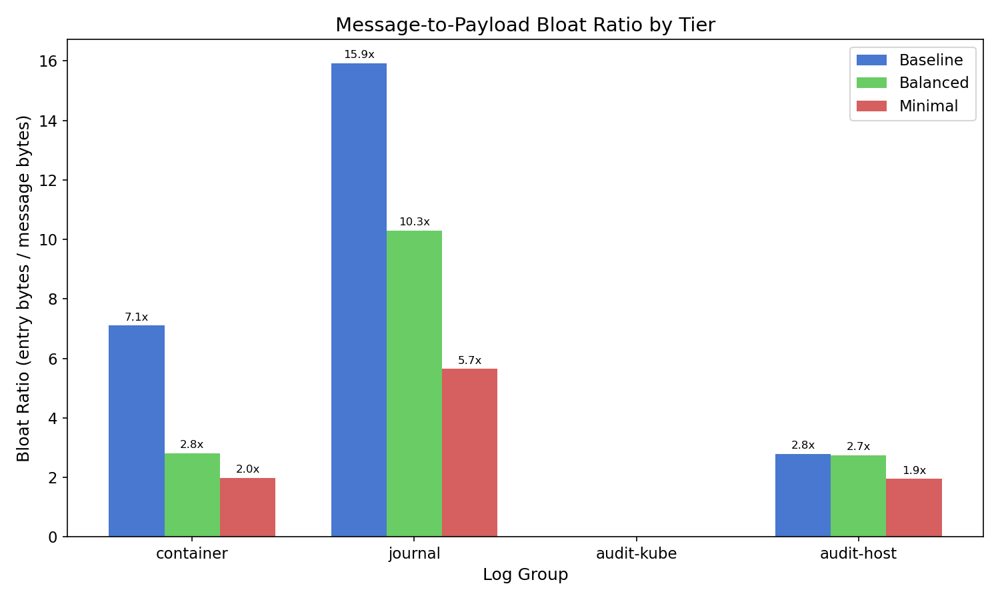
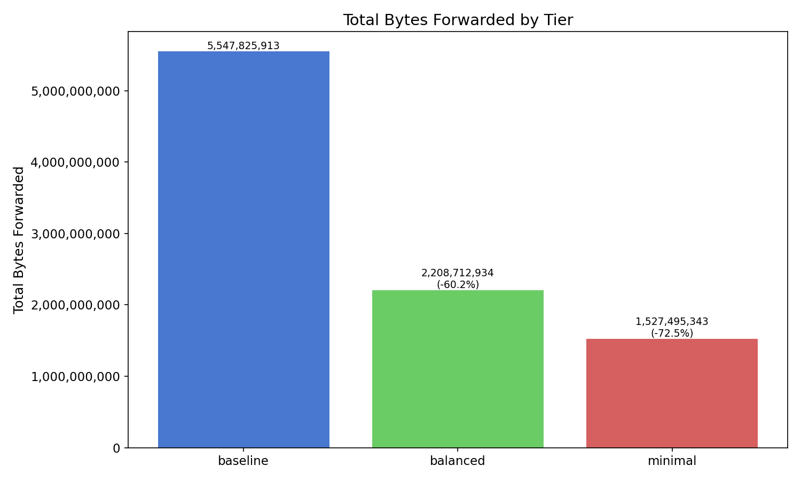
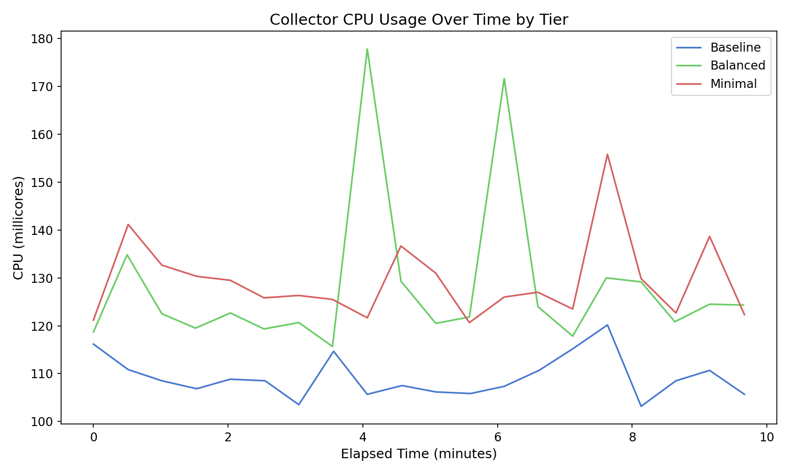
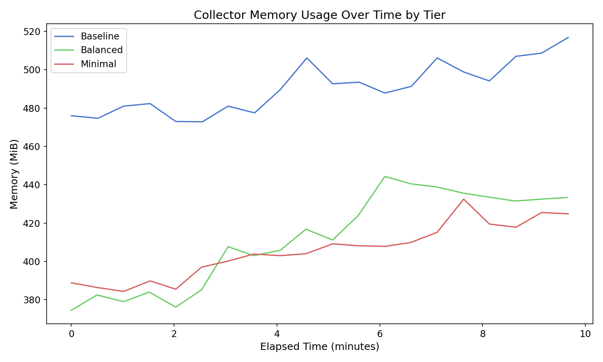

# Economizing Log Forwarding

## Introduction

OpenShift Logging collects and forwards container, journal (systemd), and
Kubernetes API audit logs. Each log entry carries metadata fields — Kubernetes
annotations, systemd transport data, audit RBAC details — that can
significantly inflate the size of forwarded log streams. On a stock cluster,
metadata overhead can account for 50–90% of a log entry's total size.

This guide shows how to reduce forwarded log volume using two existing
ClusterLogForwarder features:

- **`prune` filters** — remove specific fields from log entries before
  forwarding
- **`kubeAPIAudit` filters** — drop entire Kubernetes API audit events based
  on audit policy rules (stage, response code, user, verb)

Two recommended configurations are provided:

| Tier | Approach | Target use case |
|------|----------|----------------|
| **Balanced** | Blocklist (`prune.in`) — removes high-cost, low-value fields | Teams wanting savings without losing troubleshooting capability |
| **Minimal** | Allowlist (`prune.notIn`) — keeps only essential fields | Cost-sensitive environments prioritizing storage/bandwidth reduction |

## How We Measured

All data in this guide was collected on a 6-node OpenShift cluster running
default platform workloads plus synthetic log-generating pods annotated with
realistic metadata (Argo/Flux labels, Prometheus scrape configs, long
annotation values). Logs were forwarded simultaneously to an HTTP receiver,
LokiStack, and Google Cloud Logging.

Each tier (baseline, balanced, minimal) was measured independently: the
collector was restarted with the tier's CLF spec, given a 2-minute warmup,
then measured over a 10-minute steady-state window. Byte savings come from
`vector_component_sent_bytes_total` metric deltas; per-entry sizes from 100-entry
JSON samples; CPU/memory from `oc adm top pods` sampled every 30 seconds.

For full test plan details, see [Methodology](methodology.md).

## Understanding Your Log Costs

The following tables show per-field byte cost for each log type on a stock
OpenShift cluster. Fields are sorted by average bytes per entry.

> **Note:** Field names in these tables use data-model notation. When used in
> `prune` filter specs, any path segment containing dots, slashes, or `@` must
> be double-quoted per CLF `FieldPath` syntax. For example,
> `.kubernetes.annotations.k8s.ovn.org/pod-networks` becomes
> `.kubernetes.annotations."k8s.ovn.org/pod-networks"`, and `.@timestamp`
> becomes `."@timestamp"`. See the
> [prune filter documentation](../../features/logforwarding/filters/prune-filter.adoc)
> for details.

### container

| Field | Avg Bytes | % of Total | Presence |
|-------|-----------|-----------|----------|
| `.kubernetes.annotations.k8s.ovn.org/pod-networks` | 387 | 19.2% | 38% |
| `.kubernetes.annotations.k8s.v1.cni.cncf.io/network-status` | 169 | 8.4% | 38% |
| `.message` | 162 | 8.1% | 100% |
| `.kubernetes.container_image` | 118 | 5.9% | 100% |
| `.kubernetes.container_id` | 72 | 3.6% | 100% |
| `.kubernetes.annotations.imageregistry.operator.openshift.io/dependencies-checksum` | 71 | 3.5% | 3% |
| `.kubernetes.annotations.network.operator.openshift.io/ovnkube-script-lib-hash` | 40 | 2.0% | 6% |
| `.kubernetes.pod_owner` | 37 | 1.9% | 100% |
| `.hostname` | 37 | 1.8% | 100% |
| `.kubernetes.namespace_id` | 36 | 1.8% | 100% |
| `.kubernetes.pod_id` | 36 | 1.8% | 100% |
| `.openshift.cluster_id` | 36 | 1.8% | 100% |
| `.kubernetes.pod_name` | 32 | 1.6% | 100% |
| `.@timestamp` | 30 | 1.5% | 100% |
| `.kubernetes.namespace_labels.kubernetes_io_metadata_name` | 24 | 1.2% | 100% |

### journal

| Field | Avg Bytes | % of Total | Presence |
|-------|-----------|-----------|----------|
| `.systemd.t.CMDLINE` | 62 | 5.7% | 100% |
| `.message` | 60 | 5.5% | 100% |
| `.systemd.t.SYSTEMD_CGROUP` | 42 | 3.8% | 100% |
| `.hostname` | 36 | 3.3% | 100% |
| `.openshift.cluster_id` | 36 | 3.3% | 100% |
| `.systemd.t.BOOT_ID` | 32 | 2.9% | 100% |
| `.systemd.t.MACHINE_ID` | 32 | 2.9% | 100% |
| `.systemd.t.STREAM_ID` | 32 | 2.9% | 99% |
| `.systemd.t.SYSTEMD_INVOCATION_ID` | 32 | 2.9% | 100% |
| `.systemd.t.SELINUX_CONTEXT` | 29 | 2.7% | 100% |

### audit-kube

| Field | Avg Bytes | % of Total | Presence |
|-------|-----------|-----------|----------|
| `.annotations.authorization.k8s.io/reason` | 157 | 8.6% | 100% |
| `.requestURI` | 111 | 6.0% | 100% |
| `.user.groups` | 87 | 4.8% | 100% |
| `.userAgent` | 64 | 3.5% | 98% |
| `.user.username` | 64 | 3.5% | 100% |
| `.user.extra.authentication.kubernetes.io/credential-id` | 50 | 2.7% | 92% |
| `.user.extra.authentication.kubernetes.io/node-name` | 41 | 2.2% | 77% |
| `.user.extra.authentication.kubernetes.io/node-uid` | 40 | 2.2% | 77% |
| `.user.extra.authentication.kubernetes.io/pod-uid` | 40 | 2.2% | 77% |
| `.user.extra.authentication.kubernetes.io/pod-name` | 40 | 2.2% | 77% |

### audit-host

| Field | Avg Bytes | % of Total | Presence |
|-------|-----------|-----------|----------|
| `.message` | 206 | 33.5% | 100% |
| `.hostname` | 41 | 6.7% | 100% |
| `.openshift.cluster_id` | 36 | 5.9% | 100% |
| `.@timestamp` | 29 | 4.7% | 100% |
| `.timestamp` | 29 | 4.7% | 100% |

## Recommended Tiers

### Balanced Tier

The balanced tier removes high-cost, low-debugging-value fields using a
blocklist (`prune.in`). Fields not in the list are preserved.

| Log Group | Baseline (bytes) | Balanced (bytes) | Minimal (bytes) | Balanced Savings | Minimal Savings |
|-----------|-----------------|-----------------|----------------|-----------------|----------------|
| container | 2,703 | 1,000 | 709 | 63.0% | 73.8% |
| journal | 1,081 | 606 | 330 | 44.0% | 69.4% |
| audit-kube | 1,854 | 1,016 | 472 | 45.2% | 74.5% |

Host/OVN audit logs are excluded from this comparison. On a stock cluster
they generate very low volume (~120 entries over 3 minutes vs 40,000+
container entries) and are already compact at ~639 bytes per entry — the
bulk of which is `.message` (34%) and `.hostname` (7%), both unprunable.
The balanced tier does not target them for field-level pruning. The minimal
tier applies a conservative allowlist (message, hostname, timestamp only).

#### Container Logs

Fields removed and why:

| Field | Typical % of entry | Why it's safe to remove |
|-------|--------------------|------------------------|
| `.kubernetes.annotations` | ~28%+ | Pod network annotations and CNI status are the largest contributors. Available from the pod spec if needed. |
| `.kubernetes.container_image` | ~5% | Full image reference with SHA digest. Available from the pod spec. |
| `.kubernetes.namespace_labels` | ~4% | Many small labels, rarely used in log troubleshooting. Available from the namespace object. |
| `.kubernetes.container_id` | ~3% | Container runtime ID. Rarely needed for troubleshooting. |
| `.kubernetes.namespace_id` | ~2% | UUID, redundant with `.kubernetes.namespace_name`. |
| `.kubernetes.pod_id` | ~2% | UUID, redundant with `.kubernetes.pod_name`. |
| `.openshift.cluster_id` | ~2% | Redundant when querying a known cluster's log store. Multi-cluster setups add identity at the aggregation layer. |
| `.kubernetes.pod_owner` | ~2% | Owning resource (Deployment, DaemonSet) is inferrable from the pod name pattern. |
| `.openshift.sequence` | ~1% | CLO-internal monotonic ordering number. |
| `.kubernetes.pod_ip` | <1% | Ephemeral pod IP; search by pod name instead. |

#### Journal Logs

Fields removed and why:

| Field | Typical % of entry | Why it's safe to remove |
|-------|--------------------|------------------------|
| `.systemd.t.CMDLINE` | ~8% | Full command line. Service identity is already covered by `.systemd.t.SYSTEMD_UNIT` and `.systemd.t.COMM`. |
| `.systemd.t.SYSTEMD_CGROUP` | ~4% | Cgroup path. |
| `.systemd.t.BOOT_ID` | ~3% | Boot UUID. |
| `.systemd.t.MACHINE_ID` | ~3% | Redundant with `.hostname`. |
| `.systemd.t.STREAM_ID` | ~3% | Journal stream identifier. |
| `.systemd.t.SYSTEMD_INVOCATION_ID` | ~3% | Per-invocation UUID. |
| `.systemd.t.SELINUX_CONTEXT` | ~3% | SELinux context string. |
| Other `.systemd.t.*` / `.systemd.u.*` / `.systemd.k` | ~4% combined | Transport metadata, code locations, error numbers. |

Fields preserved: `.systemd.t.SYSTEMD_UNIT`, `.systemd.t.COMM`, `.systemd.t.PID`, `.systemd.t.TRANSPORT`, `.systemd.u.SYSLOG_IDENTIFIER`.

#### Audit Logs

The balanced tier uses two stacked filters:

1. **`kubeAPIAudit`** — Drops entire audit events:
   - Drops `RequestReceived` stage (informational, always followed by a terminal stage)
   - Drops response codes 404, 409, 422, 429 (not-found, conflicts, validation errors, throttling)
   - Logs surviving events at `Metadata` level (strips request/response bodies)

2. **`prune`** — Removes fields from surviving events:
   - `.annotations` (~9% — RBAC evaluation detail; the allow/deny decision field is sufficient)
   - `.requestURI` (~5% — redundant with `.objectRef.resource`/`.namespace`/`.name` + `.verb`)
   - `.userAgent` (~3% — client string, not needed for who/what/when analysis)
   - `.user.extra` (~12% — credential IDs, node UIDs; `.user.username` is sufficient)

**Full CLF spec:** [observability.economize-balanced.yaml](../../reference/samples/observability.economize-balanced.yaml)

### Minimal Tier

The minimal tier keeps only essential fields using an allowlist
(`prune.notIn`). Everything not listed is removed.

#### Container Logs — fields preserved

`.log_type`, `.log_source`, `.message`, `.level`, `.timestamp`, `.hostname`, `.kubernetes.namespace_name`, `.kubernetes.pod_name`, `.kubernetes.container_name`

#### Journal Logs — fields preserved

`.log_type`, `.log_source`, `.message`, `.level`, `.timestamp`, `.hostname`, `.systemd.t.SYSTEMD_UNIT`

#### API Audit Logs — fields preserved

`.log_type`, `.log_source`, `.message`, `.hostname`, `.auditID`, `.verb`, `.user.username`, `.objectRef.resource`, `.objectRef.namespace`, `.objectRef.name`, `.responseStatus.code`, `.k8s_audit_level`, `.timestamp`

Additionally, the `kubeAPIAudit` filter is more aggressive: adds 304 to
omitted response codes and silences read-only (get/list/watch) events from
system service accounts (`system:kube-proxy`, `system:node`,
`system:kube-controller-manager`, `system:kube-scheduler`).

#### Host/OVN Audit Logs — fields preserved

`.log_type`, `.log_source`, `.message`, `.hostname`, `.timestamp`

**Full CLF spec:** [observability.economize-minimal.yaml](../../reference/samples/observability.economize-minimal.yaml)

### Total Savings

Aggregate bytes forwarded over a 10-minute measurement window on a 6-node
OpenShift cluster:

| Tier | Total Bytes Forwarded | Savings vs Baseline |
|------|----------------------|--------------------|
| baseline | 5,547,825,913 | 0.0% |
| balanced | 2,208,712,934 | 60.2% |
| minimal | 1,527,495,343 | 72.5% |

## Resource Impact

Prune filters add per-event processing overhead in the collector (VRL field
removal or object reconstruction). Depending on the number and complexity of
filters, collector CPU and memory may increase slightly compared to an
unfiltered baseline with the same pipeline topology and outputs.

The net benefit of pruning is in reduced **egress, storage, and indexing
costs downstream** — which typically dominate total cost of ownership for
log pipelines.

## Customizing Your Filters

The balanced and minimal tiers are starting points. To customize:

1. Start from the tier closest to your needs
2. Check [Output Field Requirements](output-field-requirements.md) for fields
   your output type depends on
3. Add or remove fields from the `prune.in` or `prune.notIn` lists
4. Test with a representative workload before deploying to production

Key constraints:
- `.log_type`, `.log_source`, and `.message` cannot be pruned (CLO validation
  blocks this)
- Some outputs require specific fields — see the output reference for details

## Output-Specific Considerations

Different log store backends depend on different fields for routing, indexing,
and querying. Before applying prune filters, verify that your output's required
fields are preserved.

See [Output Field Requirements](output-field-requirements.md) for per-output
field constraint details.
