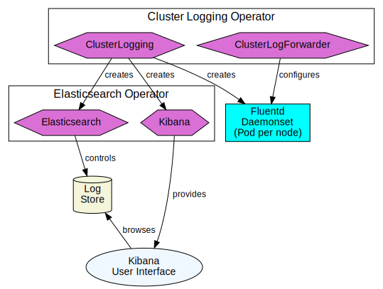
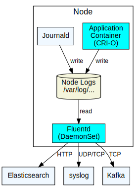

= Cluster Logging Architecture
:author: Alan Conway
:email: aconway@redhat.com
:revdate: updated {doctime}
:icons: font
ifndef::env-github[]
:toc: left
endif::[]
ifdef::env-github[]
:toc: preamble
:tip-caption: :bulb:
:note-caption: :information_source:
:important-caption: :heavy_exclamation_mark:
:caution-caption: :fire:
:warning-caption: :warning:
endif::[]
:idprefix:
:idseparator: -
:enhancement_process: https://github.com/openshift/enhancements/blob/master/guidelines/README.md
:clo_enhancements: https://github.com/openshift/enhancements/tree/master/enhancements/cluster-logging
:jira: https://issues.redhat.com/projects/LOG/issues/LOG-96?filter=allopenissues
:bugzilla: https://bugzilla.redhat.com/buglist.cgi?cmdtype=runnamed&list_id=11292768&namedcmd=All%20Cluster%20Logging%20Bugs
:clo_repo: https://github.com/openshift/cluster-logging-operator/
:elo_repo: https://github.com/openshift/elasticsearch-operator/
:oal_repo: https://github.com//openshift/origin-aggregated-logging/
:baseurl: https://github.com/openshift/cluster-logging-operator/blob/master/docs/architecture/{docname}
:source: {baseurl}.adoc
:pretty: https://htmlpreview.github.io/?{baseurl}.html

ifdef::env-github[]
NOTE: This is the ugly GitHub view, you may prefer link:{pretty}[this pretty HTML rendering]
endif::[]

== Introduction

The goals of this page are to:

* Remain brief and up-to-date; short enough to read in one sitting, updated and versioned with the code.
* Provide an overview and a snapshot of status for team members and newcomers.
* Provide links to navigate to other project <<resources>>

IMPORTANT: This page does _not_ replace or duplicate information in link:{jira}[JIRA], link:{bugzilla}[Bugzilla], link:{clo_enhancements}[enhancement proposals], or the link:{enhancement_process}[enhancment proposal process].

== Architecture Summary
=== Log categories

We define 3 _logging categories_

[horizontal]
Application:: Container logs from non-infrastrure containers.
Infrastructure:: Node logs and container logs from `kube-*` and `openshift-*` namespaces.
Audit:: Node logs from `/var/log/audit`, security sensitive.

=== Components

The logging system breaks down into 4 logical components:

[horizontal]
collector:: Read container log data from each node.
forwarder:: Forward log data to configured outputs.
store:: Store log data for analys This is the default output for the _forwarder_.
exploration:: UI tools (GUI and command line) to search, query and view stored logs

=== Operators and Custom Resources

.Key to diagrams

.Operators and APIs

The *cluster logging operator (CLO)* implements the following custom resources:

ClusterLogging (CL)::
  Deploys the _collector_ and _forwarder_ which currently are both implemented by a _daemonset_ running _Fluentd_ on each node.
ClusterLogForwarder (CLF)::
  Generate Fluentd configuration to forward logs per user configuration.

The *elasticsearch logging operator (ELO)* implements the following custom resources:

ElasticSearch::
  Configure and deploy an Elasticsearch instance as the default log store.
Kibana::
  Configure and deploy Kibana instance to search, query and view logs.

=== Runtime behavior

.Collection and forwarding

The _container runtime interface_ (CRI-O) on each node writes container logs to files.
The file names include the container's UID, namespace, name and other data.
We also collect per-node logs from the Linux _journald_.

The CLO deploys a Fluentd daemon on each node which acts both as a _collector_ (reading log files) and as a _forwarder_ (sending log data to configured outputs)

=== Log Entries ===

The term _log_ is overloaded so we'll use these terms to clarify:

Log:: A stream of text containing a sequence of _log entries_.

Log Entry::  Usually a single line of text in a log, but see <<multi-line-entries>>

Container Log:: Produced by CRI-O, combining stdout/stderr output from process running in a single container.

Node Log:: Produced by journald or other per-node agent from non-containerized processes on the node.

Structured Log::  A log where each entry is a JSON object (map), written as a single line of text.

Kubernetes does not enforce a uniform format for logs.
Anything that a containerized process writes to `stdout` or `stderr` is considered a log.
This "lowest common denominator" approach allows pre-existing applications to run on the cluster.

Traditional log formats write entries as ordered fields, but the order, field separator, format and meaning of fields varies.

_Structured logs_ write log entries as JSON objects on a single line.
However names, types, and meaning of fields in the JSON object varies between applications.

The https://github.com/kubernetes/enhancements/tree/master/keps/sig-instrumentation/1602-structured-logging[Kubernetes Structured Logging proposal] will standardize the log format for _some_ k8s components, but there will still be diverse log formats from non-k8s applications running on the cluster.

==== Metadata, Envelopes and Forwarding

_Metadata_ is additional data about a log entry (original host, container-id, namespace etc.) that we add as part of forwarding the logs. We use these terms for clarity:

[horizontal]
Message:: The original, unmodifed log entry.

Envelope:: Include metadata fields and a `message` field with the original _message_

We usually use JSON notation for the envelope since it's the most widespread convention.

However, we do and will implement other output formats formats; for example a syslog message with its `MSG` and `STRUCTURED-DATA` sections is an different way to encode the equivalent envelope data.

Depending on the output type, we may forward entries as __message_ only, full _envelope_, or the users choice.

The current metadata model is https://github.com/openshift/origin-aggregated-logging/blob/master/docs/com.redhat.viaq-openshift-project.asciidoc:[documented here].
Model documentation is generated from a https://github.com/ViaQ/elasticsearch-templates/tree/master/templates::[formal model].

CAUTION: Not all of the documented model is in active use. Review is needed.
The `labels` field is "flattened" before forwarding to Elasticsearch.

==== Multi-line Entries

Log entries are usually a single line of text, but they can consist of more than one line for several reasons:

CRI-O::
CRI-O reads chunks of text from applications, not single lines. If a line gets split between chunks, CRI-O writes each part as a separate line in the log file with a "partial" flag so they can be correctly re-assembled.

Stack traces::
Programs in languages like Java, Ruby or Python often dump multi-line stack traces into the log. The entire stack trace needs to be kept together when forwarded to be useful.

JSON Objects::
A JSON object _can_ be written on multiple lines, although structured logging libraries typically don't do this.

==  Work in progress

=== Proposals under review

* https://github.com/openshift/enhancements/pull/518::[JSON and Message Formats]
* https://github.com/openshift/enhancements/pull/457::[Pod Label Selector]

=== Flow Control/Back-pressure

**Status**: Needs write-up as link:{enhancement_process}[enhancment proposal(s)]

*TODO*: Updated diagram - CRIO to fluentd end-to-end.

* Epic https://issues.redhat.com/browse/LOG-884::[Implement proper flow control mechanisms to support more reliable log collection]
* https://issues.redhat.com/browse/LOG-575:[Prototype code showing backpressure on conmon]

Goal:
1) Sustain a predictable average load without log loss up to retention limits.
2) Handle *temporary* load spikes predictably: drop or back-pressure.
3) Handle *long-term* overload with alerts and predictable log loss at source.

Problems now:
- Uncontrolled (file-at-a-time) log loss from slow collection + node log rotation.
- Large back-up in file buffers under load: very high latencies, slow recovery.

Propose 2 qualities of service:
- _fast_: priority is low latency, high throughput, no effect on apps. _May drop data_.
n- _reliable_: Priority is to avoid data loss, but may allow loss outside of defined limits. _May slow application progress_.

In traditional terminology:
- _fast_: at-most-once
- _reliable_: at-least-once _with limits_. Even users who want reliable logging may have a breaking point where they'd rather let the application progress and lose logs. We may need configurable limits on how hard we try to be reliable.

Architecture:
- conmon writes container log files on node, log rotation (retention)
- fluentd on node: file vs. memory buffers
- forwarder target: throughput
- store target: retention
- Future: separate normalizer/forwarder, fluentbit/fluentd

Must consider data loss by forwarding protocol also:
- store (elasticsearch) review options.
- fluent-forward need to enable at-least-once acks (we don't)
- others need to review case by case if its possible.

Throughput and latency:
- evaluate throughput of each stage: node log to store/target.
- end-to-end latency, expected/acceptable variation.

Buffer sizes
- all components must maintain bounded buffers.
- without end-to-end back-pressure we cannot guarantee no data loss.
- we should be able to give better sizing/capacity guidelines.

IMPORTANT: Need well-designed (accurate, no floods, no noise) alerts for log loss and back-pressure situations

Configuration:
- Enable backpressure by pod label and/or namespace.
  - Can't impose backpressure everywhere?
- Enable rate limiting in low-latency mode (back-pressure always limits rate)

=== Error Reporting

The logging system itself can encounter errors that need to be diagnosed, examples:
* Invalid JSON received where structured logs are reuqired.
* Hard (no retry possible) errors from store or other target causing unavoidable log loss.

_Alerts_ are a key component, but alerts must be _actionable_, they can't be
used to record ongoing activity that might or might not be reviewed later.
For that we need logs.

The CLO and fluentd collector logs can be captured just like any other infrastructure log.
However, if the logging system itself is in trouble, users need a simple, direct path to diagnose the issue.
This path might have a simpler implementation that is more likely to survive if logging is in trouble.

Proposal: add a 4th logging category [application, infrastructure, audit, _logging_]
This category collects logs related to errors in the logging system, including fluentd
error messages and errors logged by the CLO.

=== Document Metadata

Decide on the supported set of envelope metadata fields and document them.

Some of our format decisions are specifically for elasticsearch (e.g. flattening maps to lists)
We need to separate the ES-specifics, either:

* Include suffficient output format configuration to cover everything we need for ES (map flattening) OR
* Move the ES-specific formatting into the elasticsearch output type.

=== Multi-line support

* Cover common stack trace types: Java, Ruby, Python, Go.
* Review need for multi-line JSON.

=== Syslog metadata

Optionally copy metadata copied to syslog https://tools.ietf.org/html/rfc5424#section-6.3[STRUCTURED-DATA]

=== Loki as store

* Benchmarking & stress testing in progress
* Configuring loki at scale.
* Test with back ends s3, boltd.

=== Observability/Telemetry

*TODO*

== Updating this page

The link:{source}[asciidoc source for this document] is on GitHub.
Create a GitHub Pull Request to request changes.

NOTE: Run `make` in the `architecture` directory to update the link:{pretty}[pretty HTML version]

== Resources

.Planning and tracking
* link:{enhancement_process}[The Enhancement Proposal Process] is how we document & discuss designs.
* link:{enhancement_repo}[Cluster Logging Enhancement Proposals] for CLO and ELO.
* https://issues.redhat.com/projects/LOG/issues/LOG-96?filter=allopenissues[JIRA project LOG] tracks feature work.
* https://bugzilla.redhat.com/buglist.cgi?cmdtype=runnamed&list_id=11292768&namedcmd=All%20Cluster%20Logging%20Bugs[Bugzilla ] tracks bugs.

.Source code
* link:{source}[Asciidoc source for this document]
* https://github.com/openshift/cluster-logging-operator[Cluster Logging Operator]
* https://github.com/openshift/elasticsearch-operator[Elasticsearch Operator]
* https://github.com/openshift/origin-aggregated-logging[Other logging dependencies (fluentd, kibana images etc.)]

.Data model
* https://github.com/openshift/origin-aggregated-logging/blob/master/docs/com.redhat.viaq-openshift-project.asciidoc:[Generated data model documentation]
* https://github.com/ViaQ/elasticsearch-templates/tree/master/templates::[Formal Model] and documentation/code generators
